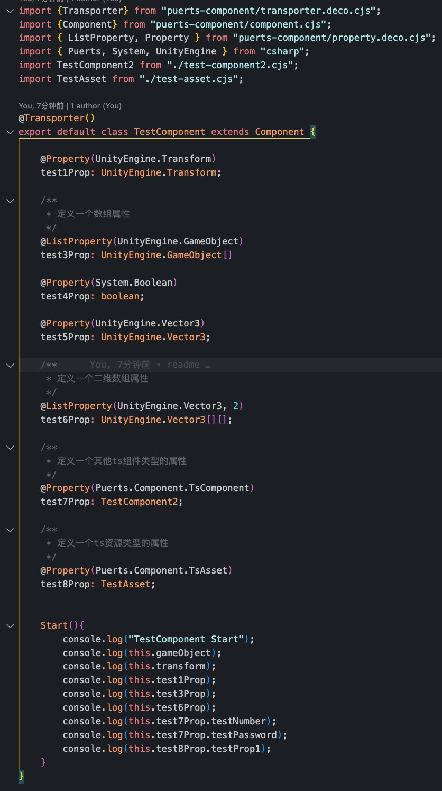

# Puerts Component

* 介绍

    [puerts框架](https://github.com/Tencent/puerts)的扩展插件，通过ts装饰器将ts类的成员变量显示在Unity Inspector面板上，实现类似MoneBehaviour和ScriptableObject的拖拽赋值功能

* 效果展示
    
    先看一下如何在ts代码中定义组件属性：
    

    这段代码对应的inspector面板上的显示效果如下：
    
    
* 还能带来哪些好处
    * 方便地从ts代码中引用unity场景中的物体和资源
    * 在ts代码中接收unity组件的生命周期回调
    * ScriptableObject也可以写ts版本啦
    * 方便地从c#测调用ts代码中的方法

* 特点
    * 功能设计相对独立，不依赖于项目中如何使用puerts插件，如何加载和编译ts代码
    * 面板显示所使用的类型信息只在Editor环境下有效，运行时不产生额外的内存消耗
    * 面板支持显示的属性类型可根据需要自行扩展，目前内置支持所有`UnityEngine.Object`的子类和几种基本数据类型，如字符串、数字、布尔、`Vector2`、`Vector3`等

* 如何运行Demo
    * `git clone` 本项目
    * `cd` 到 `TsProjDemo` 文件夹下
    * 运行 `npm install` 安装编译ts代码所需的依赖
    * 运行 `npm run build-depends` 将source-map依赖库用webpack打包成单个js文件，生成到unity工程下
    * 运行 `npm run build` 或 `npm run dev` 将src里的ts代码生成到unity工程下(dev命令会持续监听ts代码的变化)
    * 在Unity工程中打开 `Assets/Demo/SampleScene.unity` 并行
    * 如果Console面板中能打印出 `index running` 和 `TestComponent Start` 说明运行成功

* 如何将插件集成到自己项目中
    * 首先确保项目中已经集成了[puerts框架](https://github.com/Tencent/puerts)
    * 将 `Assets/PuertsComponent` 文件夹放入项目任意位置
    * 此插件依赖LitJson，如果项目中没有LitJson插件，则将`Assets/LitJson` 文件夹放入项目任意位置
    * 在项目的tsconfig.json中加入如下配置，其中的PATH/TO替换为PuertsComponent所在的文件夹相对与tsconfig.json的路径
        ```
        "paths": {
            "puerts-component/*" : [
                "PATH/TO/PuertsComponent/Typing/puerts-component/*"
            ]
        }
        ```
    * 同时确保运行时 `JsEnv.ILoader` 可以通过 `Resources.Load` 加载 `puerts-component/`开头的文件

* 使用注意
    * 被 `@Transporter()` 装饰器修饰的类必须是其所在文件的默认导出类 `export default class`
    * `@ListProperty()` 装饰器的第二个参数表示列表的维度，默认为1，表示一维数组
    * demo中和插件中使用cts和cjs作为后缀单纯是为了方便，因为Resources.Load无法加载js后缀的文件
    * 每次修改完ts组件中的属性（例如增加属性，修改属性名，修改属性装饰器类型等行为）后，需要点击Inspector面板上的Reload按钮才能刷新出对应的变化

* 已知缺陷
    * 报警告 `Serialization depth limit 10 exceeded at ...` 意思是序列化组件时出现了递归。这是因为属性中使用了嵌套结构来表示数组。但从实际序列化出来的yml格式的文本来看并没有因此影响序列化结果的大小。所以暂时没有去解决，也没想出什么办法能代替目前的嵌套结构。
    * 需要确保TsComponent和TsAsset所在的物体都在JsEnv创建之后才被加载。
    * 如果项目中存在多个JsEnv同时运行的情况，则TsComponent和TsAsset需要一定的修改才能支持。另外由于挂TsAsset的资源文件在整个运行时生命周期中`OnEnable`只在此资源被首次加载时执行一次，需要额外的处理才能使该资源文件被后创建的JsEnv引用到。

* 计划
    * 将按钮或其他unity事件指定为ts函数
    * 支持属性类型
        * ts枚举类型
        * ts任意类结构